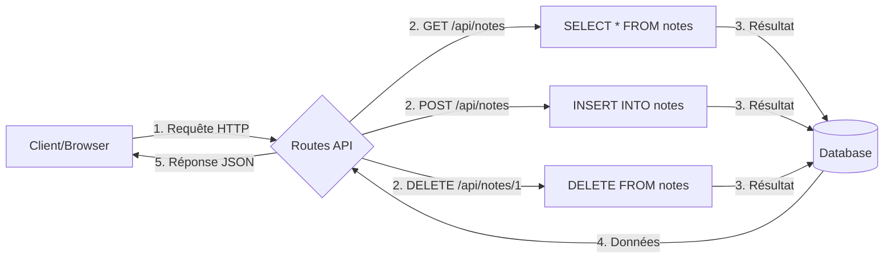

# Notions théoriques supplémentaires

<aside>


Les notions suivantes te permettront de réaliser le challenge de manière autonome.

</aside>

## Routes et API REST

Une API REST (Representational State Transfer) permet à différentes applications de communiquer entre elles en utilisant des standards HTTP.

```bash
/api/resource/action
```

- **GET** : Récupérer des données
- **POST** : Créer de nouvelles données
- **DELETE** : Supprimer des données

- **PUT/PATCH** : Modifier des données
    
    ### Voici quelques exemples de routes que tu vas utiliser :
    
    ```jsx
    GET    /api/notes     → Lister les notes
    GET    /api/notes/1   → Obtenir la note n°1
    POST   /api/notes     → Créer une note
    DELETE /api/notes/1   → Supprimer la note n°1
    ```
    

## C'est quoi une API ?

Imaginez un serveur comme un **restaurant** :

- Le **client** (votre navigateur) est le client du restaurant
- Le **serveur** est la cuisine
- L'**API** est le serveur qui prend les commandes et apporte les plats

### Exemple concret avec notre application de notes :

```jsx
// Le client (navigateur) fait une commande
fetch('/api/notes')  // C'est comme dire "Je voudrais voir toutes les notes"

// Le serveur (cuisine) prépare la réponse
{
    notes: [
        { id: 1, title: "Courses", content: "Acheter du pain" },
        { id: 2, title: "Todo", content: "Appeler maman" }
    ]
}
```

## En version très simple

1. **Routes API = Points d'entrée**

```jsx
// Ce sont vos "routes" qui écoutent les requêtes
GET    /api/notes// Point d'entrée pour lire les notes
POST   /api/notes// Point d'entrée pour créer une note
DELETE /api/notes/1// Point d'entrée pour supprimer la note 1
```

1. **Actions = Opérations Database**

```jsx
// Chaque route déclenche une action dans la base de données
GET    /api/notes     →  SELECT * FROM notes
POST   /api/notes     →  INSERT INTO notes
DELETE /api/notes/1   →  DELETE FROM notes WHERE id = 1
```

## 2. Les Méthodes HTTP : Comment parler à l'API

C'est comme les différentes façons de parler au serveur du restaurant :

### GET : "Je voudrais voir..."

```jsx
// Côté Client (Browser)
fetch('/api/notes')  // "Je voudrais voir toutes les notes"
fetch('/api/notes/1')  // "Je voudrais voir la note numéro 1"

// Côté Serveur (Node.js)
if (req.method === 'GET') {
    // C'est comme si le serveur allait chercher les notes en cuisine
    const notes = db.getNotes();
    res.end(JSON.stringify(notes));
}
```

### POST : "Je voudrais créer..."

```jsx
// Côté Client
fetch('/api/notes', {
    method: 'POST',
    body: JSON.stringify({
        title: "Courses",
        content: "Pain, lait"
    })
})
// C'est comme dire "Je voudrais créer une nouvelle note avec ce contenu"

// Côté Serveur
if (req.method === 'POST') {
    // Le serveur prend la commande et la transmet à la cuisine
    const newNote = db.addNote(title, content);
    res.end(JSON.stringify(newNote));
}
```

### DELETE : "Je voudrais supprimer..."

```jsx
// Côté Client
fetch('/api/notes/1', {
    method: 'DELETE'
})
// C'est comme dire "Je voudrais supprimer la note numéro 1"

// Côté Serveur
if (req.method === 'DELETE') {
    // Le serveur va en cuisine et jette la note
    db.deleteNote(id);
    res.end(JSON.stringify({ success: true }));
}
```

## Exemple Complet d'une API de Notes

### Le Flow Complet

1. Le client fait une demande
2. Le serveur reçoit la demande
3. Le serveur traite la demande
4. Le serveur envoie la réponse



### Comment l'utiliser côté client (frontend)

```jsx
// === Dans votre index.html ===
// Fonction pour charger toutes les notes
async function loadNotes() {
    const response = await fetch('/api/notes');
    const notes = await response.json();

// Afficher les notes dans le HTML
    const notesList = document.getElementById('notes-list');
    notesList.innerHTML = notes.map(note => `
        <div class="note">
            <h3>${note.title}</h3>
            <p>${note.content}</p>
            <button onclick="deleteNote(${note.id})">Supprimer</button>
        </div>
    `).join(''); // Ici on pourrais utiliser un cutom element HTML et passer les contenue en props
}

// Fonction pour ajouter une note
async function addNote(event) {
  // TODO //
// Recharger les notes
    loadNotes();
}

// Fonction pour supprimer une note
async function deleteNote(id) {
// TODO //
// Recharger les notes
    loadNotes();
}

// Formulaire simple qui vas trigger les actions de l'API

<form onsubmit="addNote(event)">
    <input id="title" placeholder="Titre">
    <textarea id="content" placeholder="Contenu"></textarea>
    <button>Ajouter</button>
</form>

<div id="notes-list">
    <!-- Les notes seront affichées ici -->
</div>
```

## 4. Les Points Importants à Retenir

1. **Les URLs sont comme des adresses**
    - `/api/notes` → Toutes les notes
    - `/api/notes/1` → La note spécifique n°1
2. **Les méthodes HTTP sont comme des verbes**
    - GET → Lire
    - POST → Créer
    - DELETE → Supprimer
3. **Les réponses sont en JSON**
    
    ```jsx
    {
        "success": true,
        "data": {
            "id": 1,
            "title": "Ma note",
            "content": "Mon contenu"
        }
    }
    ```
    

### Codes HTTP Courants

- 200 : Succès
- 201 : Création réussie
- 400 : Requête invalide
- 404 : Ressource non trouvée
- 500 : Erreur serveur

## **Base de données SQLite et Better-SQLite3**

SQLite est une base de données légère qui se présente sous forme d’un simple fichier. Voici les concepts essentiels :

**Dans notre projet voici une configuration simple** 

```jsx
// Tout d'abord intaller le module
npm install better-sqlite3

// Dans ton fichier database.js
const Database = require('better-sqlite3'); // importer le module
const db = new Database('notes.db'); // créer un nouvelle DB

// Ici tu pourras créer les différentes méthodes pour intéragir avec ta DB 
// addNote()
// getNote()
// getNotes() (au pluriel)
// deleteNote
```

### Opérations CRUD Basiques

**Table** : Structure qui définit le format des données que tu veux stocker.

```jsx
db.exec(`
    CREATE TABLE IF NOT EXISTS notes (
        id INTEGER PRIMARY KEY AUTOINCREMENT,
        title TEXT NOT NULL,
        content TEXT NOT NULL,
        created_at DATETIME DEFAULT CURRENT_TIMESTAMP
    )
`);
```

## Insertion (Create)

```jsx
// Préparation de la requête
const insert = db.prepare(`
    INSERT INTO notes (title, content) 
    VALUES (?, ?)
`);

// Exécution
const result = insert.run('Titre', 'Contenu');
console.log('ID de la nouvelle note:', result.lastInsertRowid);
```

## Lecture (Read)

```java
// Toutes les notes
const getAllNotes = db.prepare('SELECT * FROM notes');
const notes = getAllNotes.all();

// Une note spécifique
const getNote = db.prepare('SELECT * FROM notes WHERE id = ?');
const note = getNote.get(1);
```

## Suppression (Delete)

```jsx
const deleteNote = db.prepare('DELETE FROM notes WHERE id = ?');
const result = deleteNote.run(1);
console.log('Notes supprimées:', result.changes);
```

### Gestion des Erreurs avec Better-SQLite3

```jsx
try {
    const stmt = db.prepare('INSERT INTO notes (title) VALUES (?)');
    stmt.run('Mon titre');
} catch (err) {
    if (err.code === 'SQLITE_CONSTRAINT') {
        console.error('Erreur de contrainte:', err.message);
    } else {
        console.error('Erreur SQL:', err.message);
    }
}
```

### Bonnes Pratiques

1. **Validation des Données**
    - Toujours valider les entrées utilisateur
    - Retourner des messages d'erreur clairs
2. **Gestion des Erreurs**
    - Utiliser try/catch autour des opérations DB
    - Logger les erreurs pour le debugging
    - Retourner des réponses appropriées
3. **Sécurité**
    - Échapper les entrées utilisateur
    - Utiliser des requêtes préparées
    - Valider les types de données
    

### Test d'une Route API à l’aide de fetch

```jsx
fetch('/api/notes', {
    method: 'POST',
    headers: {
        'Content-Type': 'application/json'
    },
    body: JSON.stringify({
        title: 'Test',
        content: 'Contenu'
    })
})
.then(response => response.json())
.then(data => console.log(data))
.catch(error => console.error('Erreur:', error));
```

## Architecture Client-Serveur

Notre application de notes utilise une architecture client-serveur simplifiée, sans authentification.

### **Côté serveur (Node.js) :**

- Gère les requêtes HTTP
- Interagit avec la base de données
- Sert les fichiers statiques (HTML, CSS, JS).
- Expose une API REST pour la communication avec le client.

### **Côté Client (Navigateur)** :

- Interface utilisateur en HTML/CSS (pense à l’accessibilité et à la sémantique).
- Un simple fichier JavaScript pour gérer les interactions.
- Communication avec le serveur via l’API fetch.

### Flux de la data schématisé

Client → Requête HTTP → Serveur → Base de données
Client ← Réponse JSON ← Serveur ← Base de données

### **Gestion des Fichiers Statiques**

Le serveur doit gérer deux types de requêtes :

1. **Requêtes API** (par exemple, /api/*)
2. **Fichiers statiques** (par exemple, HTML, CSS, JS)

```jsx
// Exemple de logique de routage
if (pathname.startsWith('/api')) {
    // Gérer la requête API
} else {
    // Servir un fichier statique
}
```

### MIME Types

Les types MIME permettent au navigateur d’interpréter correctement les fichiers.

Voici ceux dont tu auras besoin dans ce projet.

```jsx
const MIME_TYPES = {
    '.html': 'text/html',
    '.css': 'text/css',
    '.js': 'text/javascript'
};
```

*Pour des types de fichiers supplémentaires (par exemple des images), tu pourrais ajouter d’autres types MIME.*

## **Communication Client-Serveur**

Le fichier `index.html` du client utilise l’API fetch pour communiquer avec le serveur. 

Voici quelques exemples :

```jsx
// Exemple de requête GET pour récupérer les notes
fetch('/api/notes')
    .then(response => response.json())
    .then(notes => {
        // Traiter les notes
    });

// Exemple de requête POST pour ajouter une nouvelle note
fetch('/api/notes', {
    method: 'POST',
    headers: { 'Content-Type': 'application/json' },
    body: JSON.stringify({ title, content })
});
```

## **Gestion des Erreurs**

### **Côté serveur ( nodejs)**

Il est important de gérer les erreurs pour éviter que l’application ne plante. Utilise des blocs try...catch pour capturer les erreurs :

```java
try {
    // Code susceptible de provoquer une erreur
} catch (error) {
    console.error('Erreur :', error);
    res.writeHead(500);
    res.end('Erreur interne du serveur');
}
```

### **Côté client (JavaScript)**

Gérer les erreurs réseau ou d’API avec un bloc catch :

```jsx
fetch('/api/notes')
    .then(response => {
        if (!response.ok) {
            throw new Error('Erreur réseau');
        }
        return response.json();
    })
    .catch(error => console.error('Erreur :', error));
```

## **Événements et Asynchronicité**

Dans ce projet, tu travailleras avec des opérations asynchrones, comme les requêtes HTTP, la lecture et l’écriture de fichiers, ou les interactions avec la base de données.

```jsx
// Exemple d'opérations asynchrones dans un serveur Node.js
server.on('request', async (req, res) => {
    try {
        await handleRequest(req, res);
    } catch (error) {
        handleError(error, res);
    }
});
```

# Pour Ethan

```css
.container {
    max-width: 800px;
    margin: 0 auto;
    padding: 20px;
}
.note-form {
    margin-bottom: 20px;
    padding: 15px;
    background-color: #f5f5f5;
    border-radius: 5px;
}
.note-form input, .note-form textarea {
    width: 100%;
    margin-bottom: 10px;
    padding: 5px;
}
.notes-list {
    margin-top: 20px;
}
.note {
    position: relative;
    padding: 10px;
    margin-bottom: 10px;
    border: 1px solid #ddd;
    border-radius: 5px;
}
.note h3 {
    margin-top: 0;
    margin-right: 30px;
}
.delete-btn {
    position: absolute;
    top: 10px;
    right: 10px;
    background: #ff4444;
    color: white;
    border: none;
    border-radius: 3px;
    padding: 5px 10px;
    cursor: pointer;
}
.delete-btn:hover {
    background: #cc0000;
}
button {
    padding: 5px 10px;
    cursor: pointer;
}
```